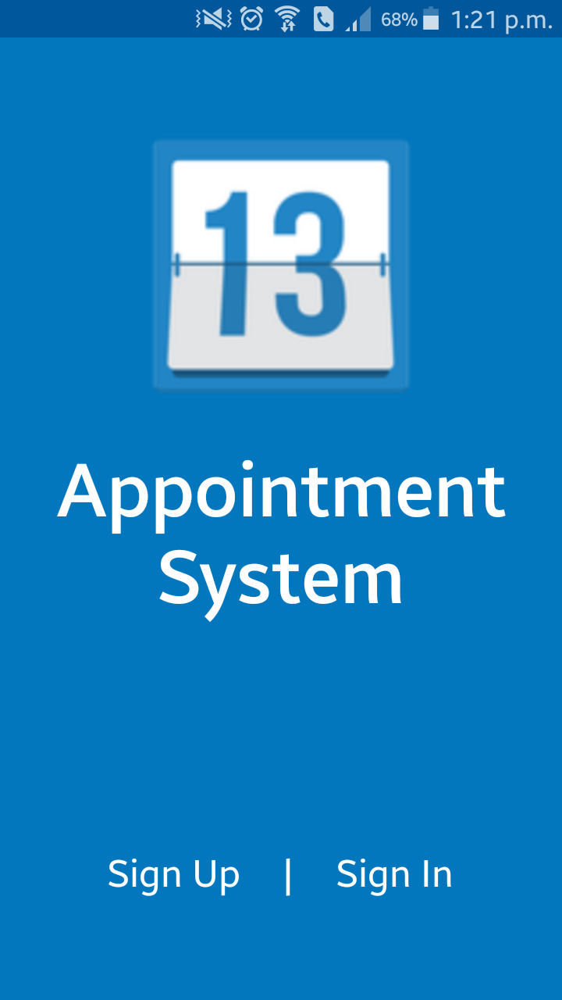
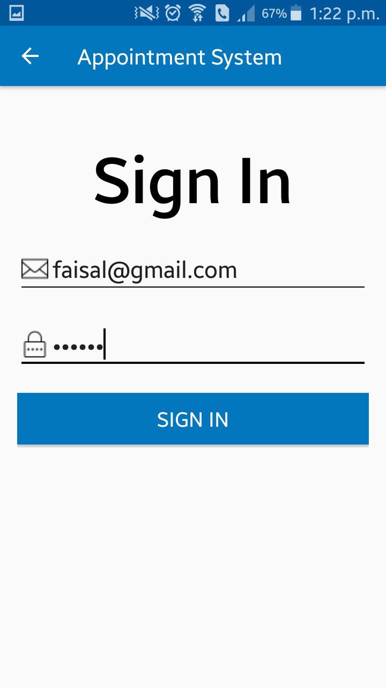

# AppointmentSystem
Appointment System is an application where one person can register as a teacher or student. Then teacher can set his free schedule for their students and students will be able see those schedule and check whether the schedule is available or not then can take an appointment if the schedule is already not booked.

## Sign Up
Students can sign up using email and password only.

Teachers have to provide their mobile number with their email and password. Then a verification code will be sent to him/her. Finally he/she has to provide that verification code for completing the sign up process.

## Welcome Screen

## Teacher Home Page
Here teachers will be able to see which appointment requests were accepted and which are not.

 

## Teacher Profile
Here teachers can update their profile and add their schedule or change their schedule. They can also check which schedule is booked and which one is free.

  

## Student Home Page
Here students will be able to see whom they sent the appointment request, which requests are pending and all the teacher list.

  

## Student Profile
Here students can update their information.

## Getting Appointment
Students have to select teacher to view their schedule.

  

Then they can take appointment by selecting the free schedule and providing an appointment topic.

 

## Logout
They can log out whenever they out by clicking the log out from menu.

